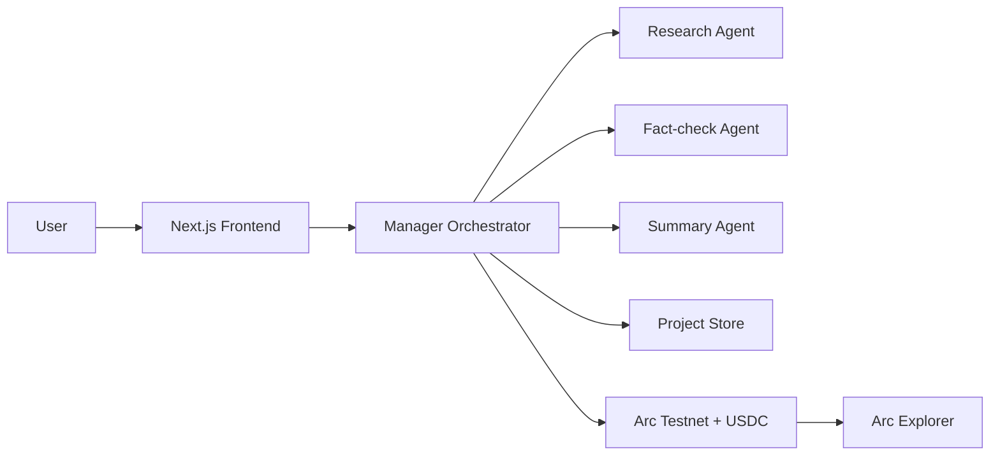

# Architecture

## High-level design

## Components

### Frontend

- Displays project brief, task board, agents, transaction feed, and economics
- Calls API routes for project data and demo execution

### Manager orchestrator

- Accepts the user brief
- Decomposes the brief into microtasks
- Assigns tasks to agents
- Triggers onchain settlement steps
- Assembles the final report

### Specialist agents

- Research agent: source discovery and competitor mapping
- Fact-check agent: claim verification and evidence review
- Summary agent: report synthesis and final memo

### Storage

- MVP can begin with in-memory or file-backed fixtures
- Next step should be `Postgres` with project, task, and transaction tables

### Arc settlement layer

- Job creation
- Escrow funding in USDC
- Deliverable submission
- Completion and payout

## Data flow

1. UI sends `POST /api/demo/run` or real execution request.
2. Orchestrator creates microtasks.
3. For each task, Arc settlement actions are initiated.
4. Deliverables are stored and linked to tx hashes.
5. Final report is returned to UI.

## Recommended production evolution

- Swap mock data for database-backed state
- Add a background worker queue
- Add Circle Wallets signing flow
- Persist agent reputation updates
- Add project replay mode for judge demos
